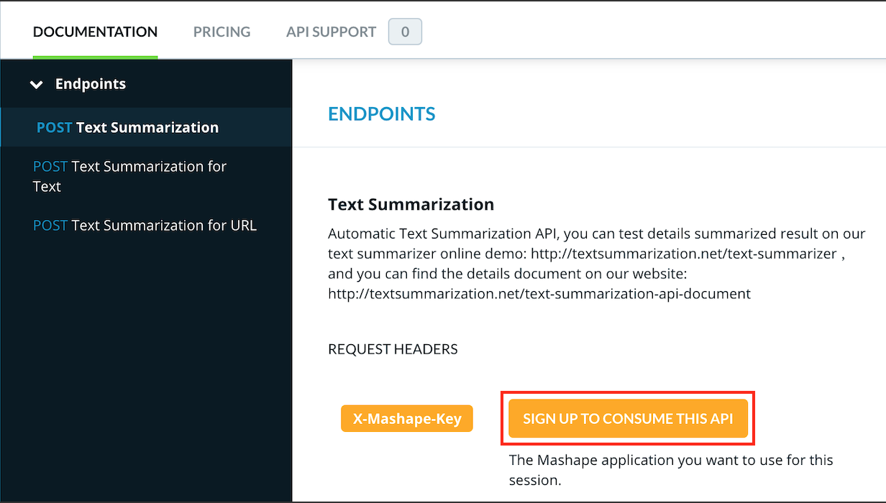
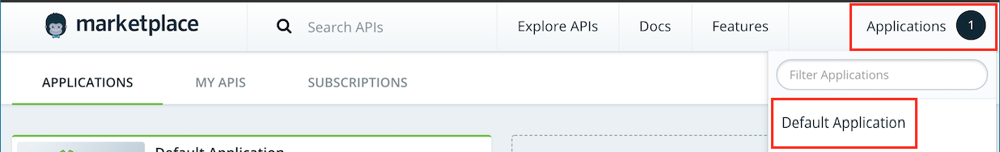
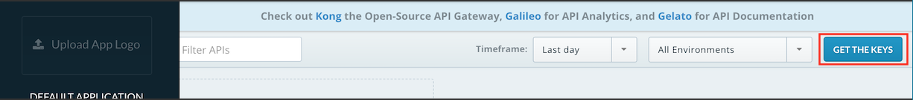
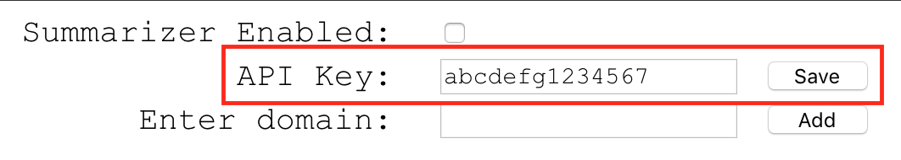

# summarizer

### Article Summarizer

A Chrome extension to summarize any web page, easily, effectively and enjoyably!

### Personal use setup

Currently Summarizer leverages an external text summarization API hosted on Mashape.

1. Go to the API at https://market.mashape.com/textanalysis/text-summarization
1. Sign up to consume the API

1. Once you're logged in go to `Applications > Default Application`

1. Click on `Get the keys` and copy your personal API key

1. Open the `Summarizer > Options` page and paste your API key, and hit `Save`

1. Back on https://market.mashape.com/textanalysis/text-summarization, hit `Pricing` and subscribe to an appropriate plan. It will ask for credit card information
1. Summarizer is now ready to use! Note that the Mashape API has **100 free calls/day**, and is paid beyond that

**Note that this is your _personal API key_. Please do not share it with anyone. Sharing it may result in unexpected payments if your payment information is on Mashape.**

### Contributing
See [CONTRIBUTING.md](CONTRIBUTING.md) for contribution information.
